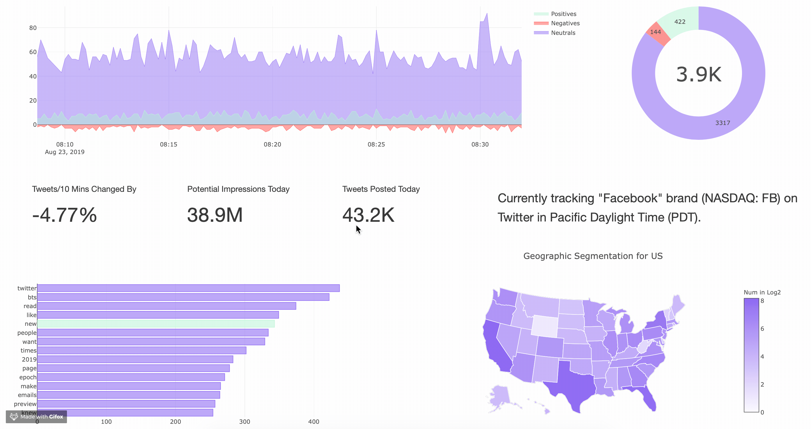

# Real-Time Brand-Monitoring-System

[]
 

#### • Brand Monitoring System was an idea that revolved around the creation of Live Dashboard using data visuals from Social Media platforms like Twitter, where one can track a specific product name or any sort of keyword and get a live representation of data on a dashboard with information related to polarity, region, etc.
#### • With the rise of social media, everyone wants to disclose their opinions regarding products over the internet. This could help organizations to get a clear understanding of How their product is doing, and act accordingly to bring updates or upgrades (if required) according to post or reviews of users over the platform.
#### • So, in order to achieve this goal twitter data was used and ingested using tweepy API via Python, which gave access to a stream of live data from posts or tweets of users across the globe, and in order to analyze the data, we first cleaned the data via various methods and stored this data onto an RDBMS (PostgreSQL). Then, we retrieved the data in order to generate dashboards using plotly and other libraries, which could be then deployed over Heroku using flask. This could help organizations take the right steps via live data-driven visuals.

### Output of Brand-Monitoring System

#### [Brand-Monitoring System](https://brand-monitoring.herokuapp.com)
